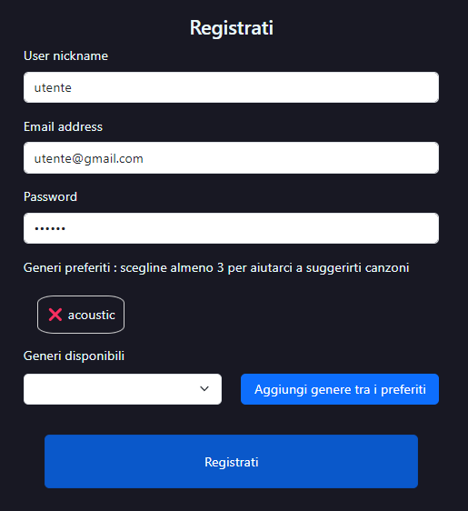

# Documentazione

## Indice

1. [Introduzione](#introduzione)
2. [Strutturazione del progetto](#strutturazione-del-progetto)
3. [Strutturazione dei dati nel database](#strutturazione-dei-dati-nel-database)
4. [Schema generale dell'applicativo](#schema-generale-dellapplicativo-web)
5. [Applicativo web: realizzazione](#applicativo-web-realizzazione)  
    I. [Pagina home: index.html](#pagina-home-indexhtml)  
    II. [Pagina per il login/registrazione: login.html](#pagina-per-il-loginregistrazione-loginhtml)  
    III. [Pagina per la modifica delle informazioni del proprio account: account.html](#pagina-per-la-modifica-delle-informazioni-del-proprio-account-accounthtml)  
    IV. [Pagina per la visualizzazione di una canzone: track.html](#pagina-per-la-visualizzazione-di-una-canzone-trackhtml)  
    V. [Pagina per la visualizzazione di un artista: artist.html](#pagina-per-la-visualizzazione-di-un-artista-artisthtml)  
    VI. [Pagina per la visualizzazione di un album: album.html](#pagina-per-la-visualizzazione-di-un-album-albumhtml)  
    VII. [Pagine per la gestione delle playlist](#pagine-per-la-gestione-delle-playlist)  

    - [Pagina per la creazione di una nuova playlist: newplaylist.html](#pagina-per-la-creazione-di-una-nuova-playlist-newplaylisthtml)
    - [Pagina per la gestione delle playlist dell'account: playlist.html](#pagina-per-la-gestione-delle-playlist-dellaccount-playlisthtml)
    - [Pagina per la visualizzazione di una playlist: infoplaylist.html](#pagina-per-la-visualizzazione-di-una-playlist-infoplaylisthtml)

## Introduzione

L'obiettivo dell'applicativo web SNM è gestire utenti che possono creare, modificare, cancellare e condividere playlist di canzoni musicali.  
Sono presenti quindi 3 macroscenari: la gestione dell'utenza, la gestione delle playlist e la gestione della condivisione delle playlist.

## Strutturazione del progetto

Lato server:  

- [api.js](../SNM/api.js) file JavaScript che contiene sia gli endpoint delle mie API che la configurazione del server, definendo la porta su cui aprire il web server, caricando i file statici e definendo la pagina HTML di base.
- [authentication.js](../SNM/authentication.js) file JavaScript che contiene la funzione per controllare l'API utilizzata negli endpoint delle mie API.
- [swagger-gen.js](../SNM/swagger-gen.js) file JavaScript utilizzato per generari il file JSON "swagger-output" per la visualizzazione della documentazione delle API all'indirizzo [/api-docs/](http://localhost:3100/api-docs/).

Lato client: [directory asset](../SNM/asset/)

- [Directory: img](../SNM/asset/img) cartella contenente le immagini utilizzate nel sito (immagine di sfondo, icona del sito e immagine di default delle card)
- [Directory: script](../SNM/asset/script) cartella contenente 2 file JavaScript:
  - [backend.js](../SNM/asset/script/backend.js) contiene le funzioni per utilizzare le mie API
  - [spotify_backend.js](../SNM/asset/script/spotify_backend.js) contiene le funzioni per utilizzare le API di Spotify
- [Directory: src](../SNM/asset/src) cartella contenente tutte le altre pagine HTML oltre a index.html.
- [Directory: style](../SNM/asset/style) cartella contenente il file CSS [style](../SNM/asset/style.ccs)
- [File: lib.js](../SNM/asset/lib.js) file JavaScript contenente le funzioni per popolare le varie pagine HTML e per utilizzare le funzioni definite nei file della cartella script.

## Strutturazione dei dati nel database

Dal punto di vista dei dati, è stato necessario salvare in un database, nel nostro caso MongoDB, le informazioni sugli utenti e sulle playlist.  
Ho creato quindi un database SNM con 2 collezioni:

- **Users**: contiene le informazioni degli utenti, in particolare:
  - l'email, definito come indice unique
  - la password non in chiaro
  - il nickname dell'utente  
  - i generi preferiti, gestiti come un Array di {name : "nomeDelGenere"}.  
- **Playlists**: contiene le informazioni delle playlist, in particolare:
  - il nome della playlist
  - un eventuale descrizione testuale
  - l'id del proprietario
  - un booleano public per determinare se la playlist sia pubblica (true) o privata (false)
  - le track/canzoni della playlist, gestite come una Array di Objects (l'oggetto è quello restituito dall'API di Spotify)
  - i tag associati alla playlist, gestiti come un Array di {name : "nomeTag"}
  - i followers della playlist, gestiti come una Array di {id : "idUtente"}

## Schema generale dell'applicativo web

## Scelte implementativi

In generale quasi tutti i componenti delle pagine HTML vengono generati con una funzione di print... definita in [lib.js](../SNM/asset/lib.js) in quanto il contenuto degli stessi e la loro eventuale presenza dipende da vari fattori quali:

- L'accesso con le proprie credenziali da parte dell'utilizzatore consente di eseguire azioni precluse se non si effettua l'accesso.
- Il ruolo che ricopre l'utente nella playlist: follower, proprietario o utilizzatore non registrato.

Per verificare che l'utente sia loggato o meno all'interno dell'applicativo, utilizzo due variabili nel localStorage, "user" che contiene l'id dell'utente e "nickname" che utilizzo nel menu (per questioni di ottimizzazione lo salvo nel localStorage invece che effettuare una chiamata API per recuperare le informazioni dell'utente ogni volta che carico una pagina con la navbar).  

Le pagine utilizzate per la visualizzazione delle informazioni di canzoni, artisti, album e playlist hanno l'id del oggetto di interessa nell'url in modo che sia facilmente reperibile.  
es <http://localhost:3100/src/track.html?0JONs2ETXIHvYVxNris8Bf>, in questo caso "0JONs2ETXIHvYVxNris8Bf" è l'id della canzone che si vuole visualizzare.  

Gli elementi visualizzati tramite card sono gestiti con una paginazione che ne consente la visualizzazione di 5 elementi alla volta, per evitare un'eccessiva presenza di card.

## Applicativo web: realizzazione

### Pagina home: index.html

- Utente non loggato

La pagina base contiene:

- la visualizzazione delle playlist pubbliche, di cui è possibile visualizzarne le informazioni cliccando sull'immagine della card.
- la visualizzazione delle 50 canzoni migliori al momento in Italia, di cui è possibile visualizzarne le informazioni cliccando sull'immagine della card o sul titolo, oppure le informazioni dell'autore cliccando sul suo nome.
- la possibilità di ricercare canzoni, artisti, album, playlist e tag dei playlist mediamente un menu di ricerca.

- Utente loggato

Oltre agli elementi sopra elencati, vengono visualizzate anche le playlist dell'utente e le playlist che segue l'utente.  

Inoltre per ogni playlist è possibili eseguire delle azioni in base al ruolo ricoperto:

- ❌ per cancellare la playlist SE l'utente è il proprietario della playlist
- ❌ per togliere il follow alla playlist SE si seguiva già la playlist
- ➕ per aggiungere il follow alla playlist SE non si seguiva ancora la playlist

---

### Pagina per il login/registrazione: login.html

Questa pagina è accessibile solo ad utilizzatore non ancora loggati.  
E' divisa in due parti consentendo:

- La registrazione di un nuovo utente: dovranno essere specificati:
  - nickname: non vuoto
  - email: non vuota, unica e contenente @
  - password: non vuota
  - generi preferiti: almeno un genere preferito, selezionabile da una lista contenente i generi forniti da Spotify
- L'accesso con le proprie credenziale: email e password

Nel caso di errori nella compilazioni dei campi, viene visualizzato un paragrafo contenente il messaggio e il codice di errore.

---

### Pagina per la modifica delle informazioni del proprio account: account.html

Questa pagina è accessibile solo ad utilizzatore già loggati.  
Qui è possibile modificare le informazioni associate al proprio account che vengono carite negli appositi input, in particolare:

- La propria email
- Il proprio nickname
- La propria password (viene richiesto di spuntare una checkbox se la si vuole modificare in modo tale da non caricare in chiaro la password precedente e da non obbligare l'utente a cambiarla)
- I generi preferiti selezionabili dall'apposita lista

Nel caso di errori nella compilazioni dei campi, viene visualizzato un paragrafo contenente il messaggio e il codice di errore.

E' anche possibile cancellare del tutto il proprio account, causando la cancellazione di tutte le playlist di cui si era proprietari e viene tolto il proprio follow a tutte le playlist in cui era presente.

---

### Pagina per la visualizzazione di una canzone: track.html

- Utente non loggato

La pagina presenta le informazioni della canzone ed eventualmente una sua preview.  
Vengono poi visualizzate le canzoni migliori dell'artista della canzone.

- Utente loggato

Oltre agli elementi sopra citati, è possibile anche aggiungere la canzone ad una playlist di cui l'utente è proprietatio, selezionandola dall'apposita lista.

Sia nel caso di errore, se la canzone era già presente nella playlist, sia nel caso di successo, viene visualizzato in alert.

---

### Pagina per la visualizzazione di un artista: artist.html

La pagina presenta le informazioni dell'artista quali i generi associati e il numero di follower.  
Vengono poi presentate le migliori canzoni dell'artista e gli album dell'artista, di cui si possono visualizzare le informazioni cliccando sull'immagine della card o sul titolo dell'album.

---

### Pagina per la visualizzazione di un album: album.html

- Utente non loggato  
La pagina presenta le informazioni dell'album e l'elenco delle canzoni contenuto in esso.

- Utente loggato  
Oltre agli elementi sopra citati, è possibile aggiungere ogni canzone ad una propria playlist.

---

### Pagine per la gestione delle playlist  

---

### Pagina per la creazione di una nuova playlist: newplaylist.html

Questa pagina è accessibile solo se l'utente è loggato.  

Per creare una nuova playlist è necessario almeno compilare il campo del nome della playlist, mentre gli altri sono opzionali.  

E' possibile aggiungere una descrizione, una lista di tag ed eventualmente rendere privata la playlist (di default è pubblica).

---

### Pagina per la gestione delle playlist dell'account: playlist.html

Questa pagina è accessibile solo se l'utente è loggato.  

In questa pagina sono elencato le playlist create dall'utente, quelle che segue l'utente e l'elenco delle playlist pubbliche.

E' possibile eseguire le stesse azioni previste in index.html ed eventualmente premere sull'immagine della card per visualizzarne le informazioni.

E' anche presente eseguire una ricerca delle playlist pubbliche, filtrandole dato il nome della playlist, il nome di un tag della playlist o il titolo di una canzone contenuta nelle playlist.

---

### Pagina per la visualizzazione di una playlist: infoplaylist.html

- Utente non loggato

Questa pagina presenta le informazioni della playlist e l'elenco delle canzoni contenute in essa, con eventualmente una preview.

- Utente loggato non proprietario

Oltre gli elementi del punto precedente, l'utente puo seguire la playlist (se non la seguiva) o smettere di seguirla (se gia la seguiva) e puo aggiungere ogni canzone presente nella playlist in una sua playlist.

- Utente loggato proprietario

Oltre agli elementi del prunto precedente, l'utente puo modificare i tag associati alla playlist, aggiungendone o togliendone di già presenti, puo rendere pubblica/privata la playlist o puo cancellarla definitivamente.

Puo poi rimuovere una canzone presente nella playlist o puo aggiungerne di nuove, dato un elenco di canzoni suggerite, in base ai generi preferiti presenti nel suo profilo utente.

